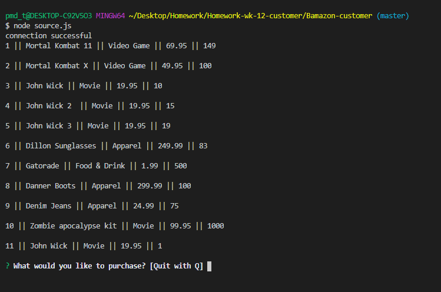
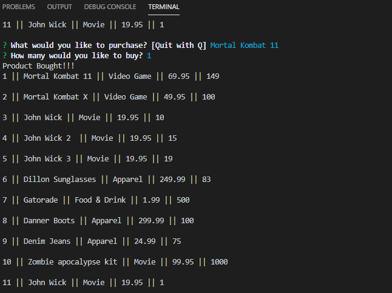

# Bamazon-customer
Created a MySQL Database called bamazon.

Created a Table inside of that database called products.

The products table have each of the following columns:

item_id (unique id for each product)

product_name (Name of product)

department_name

price (cost to customer)

stock_quantity (how much of the product is available in stores)

Populated this database with around 10 different products. (i.e. Insert "mock" data rows into this database and table).

Created a Node application called bamazonCustomer.js. Running this application will first display all of the items available for sale. Include the ids, names, and prices of products for sale.

the app will then prompt users with two messages.

The first should ask them the ID of the product they would like to buy.
The second message should ask how many units of the product they would like to buy.

Once the customer has placed the order, your application should check if your store has enough of the product to meet the customer's request.

